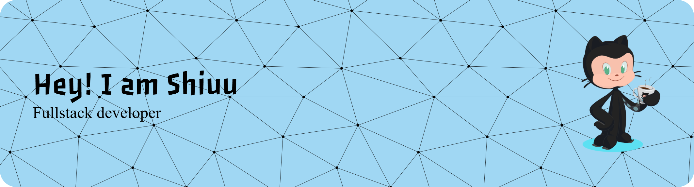

 
<a href="https://www.dev.to/Shiuu28" target="_blank" rel="noreferrer"> <picture> <source media="(prefers-color-scheme: dark)" srcset="https://raw.githubusercontent.com/danielcranney/readme-generator/main/public/icons/socials/devdotto-dark.svg" /> <source media="(prefers-color-scheme: light)" srcset="https://raw.githubusercontent.com/danielcranney/readme-generator/main/public/icons/socials/devdotto.svg" />  </picture> </a> 
<a href="https://www.linkedin.com/in/shiuu-valenzuela-penagos-7872a72a1" target="_blank" rel="noreferrer"> <picture> <source media="(prefers-color-scheme: dark)" srcset="https://raw.githubusercontent.com/danielcranney/readme-generator/main/public/icons/socials/linkedin-dark.svg" /> <source media="(prefers-color-scheme: light)" srcset="https://raw.githubusercontent.com/danielcranney/readme-generator/main/public/icons/socials/linkedin.svg" />  </picture> </a> 
<a href="https://discord.com/users/Shiuu28" target="_blank" rel="noreferrer"> <picture> <source media="(prefers-color-scheme: dark)" srcset="https://raw.githubusercontent.com/danielcranney/readme-generator/main/public/icons/socials/discord-dark.svg" /> <source media="(prefers-color-scheme: light)" srcset="https://raw.githubusercontent.com/danielcranney/readme-generator/main/public/icons/socials/discord.svg" />  </picture> </a>
<a href="https://giddy-song-fa5.notion.site/Shiuu-Valenzuela-Penagos-2440596e5078808aae0ce2b2a7419dd3" target="_blank" rel="noreferrer"> <picture>  </picture> </a>

## 
## <picture></picture> ***About me***

I am currently studying Software Analysis and Development. I am passionate about technology and am constantly learning to strengthen my technical skills and knowledge. My goal is to create, lead, and add value to projects that have a significant impact.

## <picture> </picture> ***Github Stats***

##
<picture>  </picture> 
<picture></picture> ***My professional experience***
 

>**Microsoft Colombia | Fundación Nana | JUNA**

**Role AI Development**

* ✅ Structuring and cleaning data sets
* ✅ Model training and evaluation
* ✅ Base model configuration        
* ✅ Unit testing of functionality  
* ✅ Test automation with GitHub Actions
* ✅ Implementation of incremental learning methodology
* ✅ Migration to Azure Machine Learning

##  

